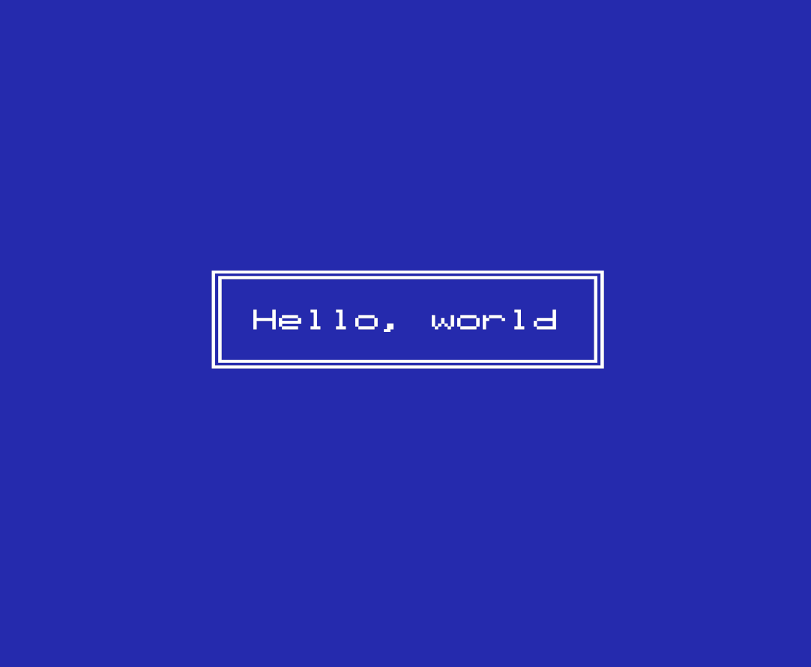

# Programming the NES

A series of simple programs to demonstrate the basics of programming the NES.

## 01: Hello, world

Demonstrates using the cc65 build tools, the basic form of an NES program written in assembly, and a simple way to draw to the screen.
